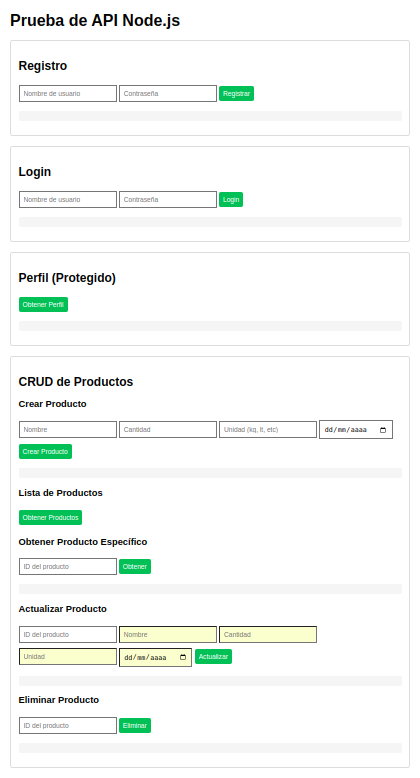

# 🛒 Sistema de Gestión de Productos

API con autenticación JWT y CRUD de productos, conectada a MySQL.

## 🚀 Tecnologías Utilizadas
- **Backend**: Node.js + Express
- **Base de datos**: MySQL
- **Autenticación**: JWT + bcrypt
- **Frontend**: HTML5/CSS3/JavaScript vanilla

## 📂 Estructura del Proyecto
```plaintext
.
├── config.js         # Configuración global
├── index.js          # Servidor y rutas principales
├── db/
│   ├── connection.js # Conexión a MySQL
│   ├── auth.js       # Lógica de autenticación
│   └── products.js   # Operaciones CRUD
└── public/
    └── index.html    # Interfaz web completa
```

## 🔧 Configuración Inicial

1. **Instalar dependencias**:
```bash
npm install express mysql2 bcryptjs jsonwebtoken cors
```

2. **Configurar base de datos**:
- Crear una base de datos MySQL llamada `proyecto2`
- Ejecutar este script SQL:
```sql
CREATE TABLE usuarios (
  id INT AUTO_INCREMENT PRIMARY KEY,
  nombreUsuario CHAR(50) NOT NULL UNIQUE,
  password CHAR(255) NOT NULL,
  es_admin TINYINT(1) DEFAULT 0
);

CREATE TABLE productos (
  id INT AUTO_INCREMENT PRIMARY KEY,
  nombre VARCHAR(100) NOT NULL,
  cantidad DECIMAL(10,2) NOT NULL,
  unidad VARCHAR(20),
  fecha_compra DATE,
  usuario_id INT,
  FOREIGN KEY (usuario_id) REFERENCES usuarios(id)
);
```

## 🏃 Ejecución
```bash
node index.js
```
El servidor estará disponible en: `http://localhost:3000`

## 📚 Documentación de la API

### Autenticación
| Método | Endpoint    | Descripción                |
|--------|-------------|----------------------------|
| POST   | /registro   | Registro de nuevos usuarios|
| POST   | /login      | Inicio de sesión (JWT)     |

### Productos (requieren JWT)
| Método | Endpoint         | Descripción                 |
|--------|------------------|-----------------------------|
| GET    | /productos       | Obtener todos los productos |
| POST   | /productos       | Crear nuevo producto        |
| PUT    | /productos/:id   | Actualizar producto         |
| DELETE | /productos/:id   | Eliminar producto           |

## 🌟 Características Clave
- ✅ Autenticación segura con JWT
- ✅ Pool de conexiones MySQL para mejor rendimiento
- ✅ Interfaz web responsive
- ✅ Validación en frontend y backend
- ✅ Fácil despliegue

## 🖥️ Interfaz Web


La interfaz incluye:
- Login/registro
- Formulario CRUD intuitivo
- Tabla de productos con ordenamiento
- Edición rápida con doble clic

## 📝 Licencia
MIT License - © 2023 [Alexis Martinez Miguel]